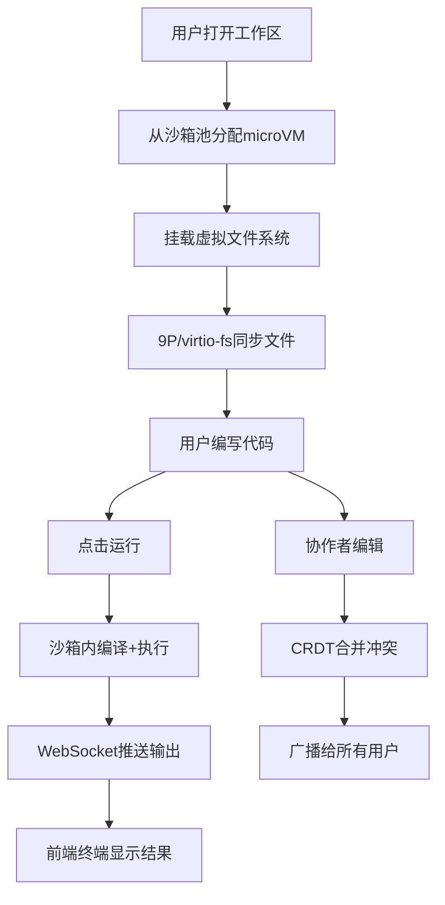

## 1. 产品概述

SandboxOS 是一个多租户安全代码沙箱平台，类似于 repl.it，为开发者提供浏览器内的完整 IDE 体验和隔离的代码执行环境。平台通过 Firecracker microVM / gVisor 实现内核级沙箱隔离，支持 Python、Node.js、C++、Rust 等多语言执行，并提供实时协作编辑功能。

- **目标用户**：在线编程学习者、技术面试平台、CI/CD 代码执行服务、教育机构
- **核心价值**：毫秒级冷启动的隔离代码执行 + 完整的浏览器端开发体验 + 安全的多租户隔离

## 2. 核心功能

### 2.1 用户角色

| 角色 | 注册方式 | 核心权限 |
|------|----------|----------|
| 免费用户 | 邮箱/GitHub注册 | 创建3个沙箱、基础语言支持、500MB存储 |
| Pro用户 | 付费订阅 | 无限沙箱、全语言支持、5GB存储、协作功能 |
| 管理员 | 后台分配 | 用户管理、沙箱监控、系统配置 |

### 2.2 功能模块

1. **工作区页面**：文件树、Monaco编辑器、xterm.js终端、沙箱控制面板
2. **仪表盘页面**：沙箱列表、资源监控、快照管理
3. **协作页面**：实时光标、共享终端、聊天侧栏

### 2.3 页面详情

| 页面名称 | 模块名称 | 功能描述 |
|----------|----------|----------|
| 工作区 | 文件树面板 | 目录浏览、文件创建/删除/重命名、拖拽排序、右键上下文菜单 |
| 工作区 | Monaco编辑器 | 语法高亮、智能补全、多标签编辑、迷你地图、查找替换 |
| 工作区 | 终端面板 | xterm.js终端模拟、实时输出流、编译/运行分离输出、ANSI颜色支持 |
| 工作区 | 沙箱控制面板 | 启动/停止/重启沙箱、资源用量仪表盘、语言切换、环境变量配置 |
| 工作区 | 协作面板 | 在线用户头像列表、实时光标位置、只读终端共享、聊天消息 |
| 仪表盘 | 沙箱列表 | 沙箱卡片列表、状态标签、快速操作按钮、搜索过滤 |
| 仪表盘 | 资源监控 | CPU/内存/磁盘实时图表、沙箱池状态、配额使用情况 |
| 仪表盘 | 快照管理 | 快照时间线、回滚操作、快照对比、自动快照策略 |
| 登录/注册 | 认证表单 | 邮箱注册登录、GitHub OAuth、JWT令牌管理 |

## 3. 核心流程

### 3.1 沙箱执行流程

用户打开工作区 → 系统从预热沙箱池分配microVM → 挂载用户虚拟文件系统 → 文件通过9P/virtio-fs同步到沙箱 → 用户编写代码 → 点击运行 → 后端在隔离环境中执行 → 编译输出和运行输出通过WebSocket实时推送到前端终端 → 执行完毕后资源回收

### 3.2 协作编辑流程

协作者加入 → 通过CRDT合并编辑状态 → 每次编辑操作广播给所有协作者 → 本地先应用再异步确认 → 冲突自动合并 → 终端输出只读共享给所有协作者

## 4. 用户界面设计

### 4.1 设计风格

- **主色调**：深色主题为主（#0D1117 背景），辅以电光蓝(#58A6FF)和翠绿(#3FB950)作为强调色
- **次色调**：暗灰(#161B22)面板背景、中灰(#30363D)边框、亮灰(#8B949E)辅助文字
- **按钮风格**：圆角(6px)、微3D效果(box-shadow)、hover发光效果
- **字体**：代码区 JetBrains Mono / Fira Code，UI区使用 DM Sans
- **布局风格**：三栏布局（文件树 | 编辑器 | 终端），可拖拽调整面板大小
- **图标风格**：线性图标(lucide-react)，16px/20px尺寸
- **整体氛围**：工业级/黑客风，暗色+发光边框+终端美学

### 4.2 页面设计概览

| 页面名称 | 模块名称 | UI元素 |
|----------|----------|--------|
| 工作区 | 文件树面板 | 深色背景、缩进树形结构、文件类型图标、hover高亮行、右键菜单浮层 |
| 工作区 | Monaco编辑器 | 深色VS Code主题、顶部标签栏、底部状态栏(语言/行列)、侧边迷你地图 |
| 工作区 | 终端面板 | 黑底绿字终端风格、顶部标签(编译输出/运行输出)、可拖拽分割线 |
| 工作区 | 沙箱控制面板 | 圆形进度仪表盘(CPU/内存)、脉冲动画状态灯、药丸状按钮组 |
| 工作区 | 协作面板 | 头像圆圈(在线/离线状态)、编辑光标(用户色)、聊天气泡 |
| 仪表盘 | 沙箱列表 | 卡片网格、悬浮阴影效果、状态徽章(运行中/已停止)、进度条 |
| 仪表盘 | 资源监控 | 面积图/折线图(Chart.js)、渐变填充、实时更新动画 |
| 仪表盘 | 快照管理 | 垂直时间线、节点卡片、回滚确认对话框 |
| 登录页 | 认证表单 | 居中卡片、背景粒子动画、渐变按钮、GitHub图标按钮 |

### 4.3 响应式策略

- 桌面优先设计，最小支持1280px宽度
- 文件树面板可折叠，终端面板可最小化
- 移动端：隐藏文件树(改为抽屉)、编辑器全屏、终端底部弹出
- 触控优化：面板拖拽区域增大、按钮最小44px触控区

### 4.4 动效设计

- 沙箱启动：状态灯脉冲动画(灰色→黄色→绿色)
- 终端输出：逐字符打字机效果
- 文件树操作：节点展开/折叠过渡动画
- 协作光标：平滑移动动画
- 面板调整：弹性拖拽反馈
- 页面加载：骨架屏+渐显过渡
