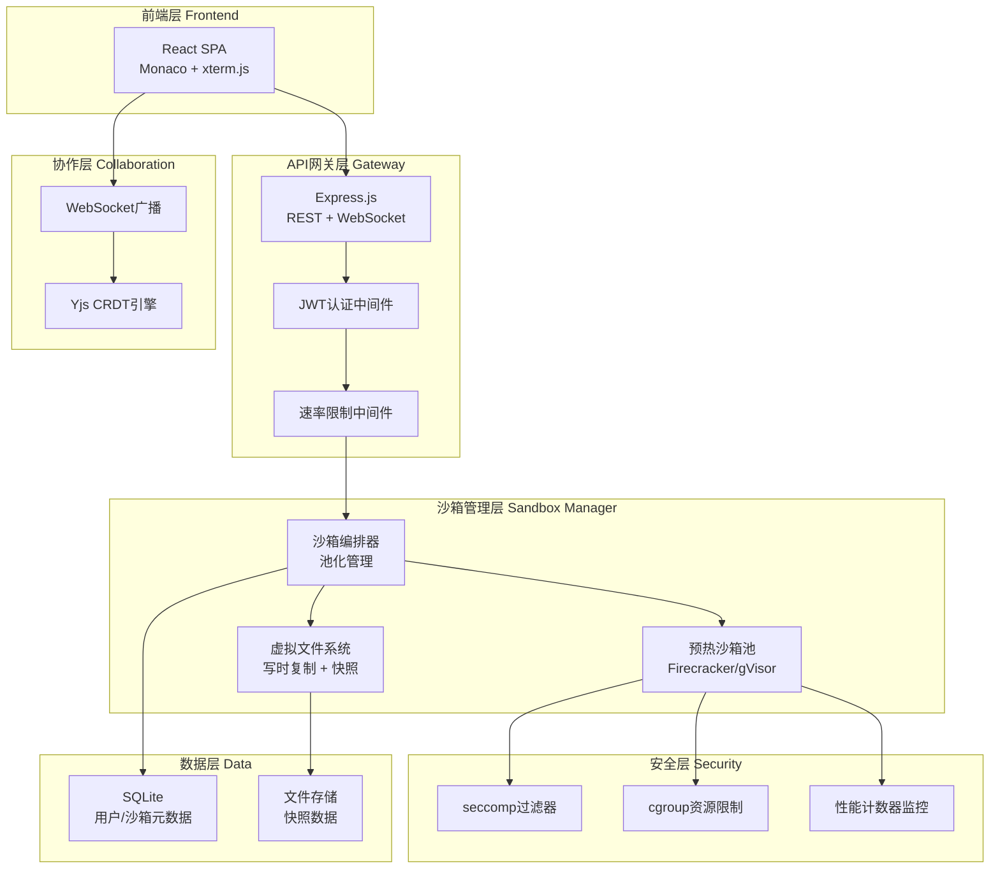
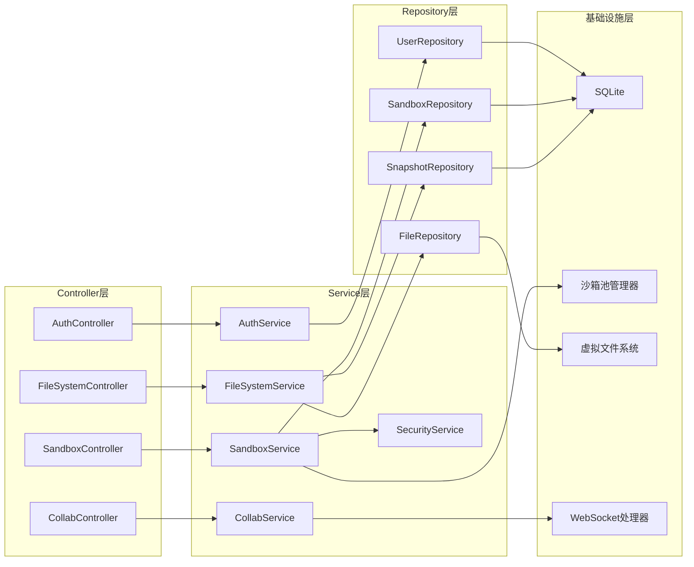
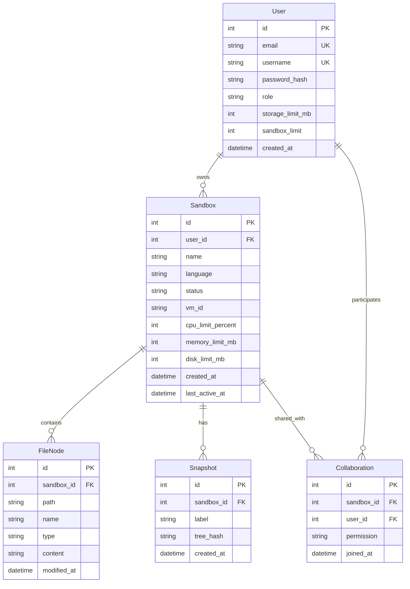

## 1. 架构设计



## 2. 技术说明

- **前端**：React@18 + TypeScript + TailwindCSS@3 + Vite
- **初始化工具**：vite-init (react-express-ts模板)
- **后端**：Express@4 + TypeScript (ESM)
- **数据库**：SQLite (better-sqlite3)
- **代码编辑器**：@monaco-editor/react
- **终端模拟器**：xterm.js + xterm-addon-fit + xterm-addon-web-links
- **CRDT引擎**：yjs + y-websocket
- **图表库**：chart.js + react-chartjs-2
- **图标库**：lucide-react
- **状态管理**：zustand
- **实时通信**：ws (WebSocket)

## 3. 路由定义

| 路由 | 用途 |
|------|------|
| `/` | 登录/注册页面 |
| `/dashboard` | 仪表盘 - 沙箱列表、资源监控、快照管理 |
| `/workspace/:id` | 工作区 - IDE编辑器、文件树、终端 |
| `/workspace/:id/collab` | 协作工作区 - 多人编辑+共享终端 |

## 4. API定义

### 4.1 认证API

```typescript
interface AuthAPI {
  POST /api/auth/register: {
    body: { email: string; password: string; username: string }
    response: { token: string; user: User }
  }
  POST /api/auth/login: {
    body: { email: string; password: string }
    response: { token: string; user: User }
  }
  GET /api/auth/github: {
    response: { redirectUrl: string }
  }
}
```

### 4.2 沙箱API

```typescript
interface SandboxAPI {
  GET /api/sandboxes: {
    response: { sandboxes: Sandbox[] }
  }
  POST /api/sandboxes: {
    body: { name: string; language: "python" | "nodejs" | "cpp" | "rust" }
    response: { sandbox: Sandbox }
  }
  POST /api/sandboxes/:id/start: {
    response: { sandbox: Sandbox; wsUrl: string }
  }
  POST /api/sandboxes/:id/stop: {
    response: { sandbox: Sandbox }
  }
  DELETE /api/sandboxes/:id: {
    response: { success: boolean }
  }
  GET /api/sandboxes/:id/status: {
    response: { status: SandboxStatus; metrics: ResourceMetrics }
  }
}
```

### 4.3 文件系统API

```typescript
interface FileSystemAPI {
  GET /api/sandboxes/:id/files?path=:path: {
    response: { files: FileNode[] }
  }
  GET /api/sandboxes/:id/files/content?path=:path: {
    response: { content: string }
  }
  PUT /api/sandboxes/:id/files/content: {
    body: { path: string; content: string }
    response: { success: boolean }
  }
  POST /api/sandboxes/:id/files/mkdir: {
    body: { path: string; name: string }
    response: { node: FileNode }
  }
  DELETE /api/sandboxes/:id/files?path=:path: {
    response: { success: boolean }
  }
  POST /api/sandboxes/:id/snapshots: {
    body: { label: string }
    response: { snapshot: Snapshot }
  }
  POST /api/sandboxes/:id/snapshots/:sid/rollback: {
    response: { success: boolean }
  }
  GET /api/sandboxes/:id/snapshots: {
    response: { snapshots: Snapshot[] }
  }
}
```

### 4.4 WebSocket协议

```typescript
interface WSMessage {
  type: "execute" | "output" | "input" | "resize" | "collab_edit" | "cursor" | "chat"
  payload: Record<string, unknown>
}

interface ExecutePayload {
  command: string
  args?: string[]
  cwd?: string
  env?: Record<string, string>
}

interface OutputPayload {
  stream: "stdout" | "stderr" | "compile"
  data: string
  timestamp: number
}
```

### 4.5 协作API

```typescript
interface CollaborationAPI {
  POST /api/sandboxes/:id/collab/invite: {
    body: { email: string; permission: "edit" | "read" }
    response: { inviteUrl: string }
  }
  GET /api/sandboxes/:id/collab/users: {
    response: { users: CollabUser[] }
  }
}
```

## 5. 服务端架构图



## 6. 数据模型

### 6.1 数据模型定义



### 6.2 数据定义语言

```sql
CREATE TABLE users (
  id INTEGER PRIMARY KEY AUTOINCREMENT,
  email TEXT UNIQUE NOT NULL,
  username TEXT UNIQUE NOT NULL,
  password_hash TEXT NOT NULL,
  role TEXT NOT NULL DEFAULT 'user' CHECK(role IN ('user', 'pro', 'admin')),
  storage_limit_mb INTEGER NOT NULL DEFAULT 500,
  sandbox_limit INTEGER NOT NULL DEFAULT 3,
  created_at TEXT NOT NULL DEFAULT (datetime('now'))
);

CREATE TABLE sandboxes (
  id INTEGER PRIMARY KEY AUTOINCREMENT,
  user_id INTEGER NOT NULL REFERENCES users(id) ON DELETE CASCADE,
  name TEXT NOT NULL,
  language TEXT NOT NULL CHECK(language IN ('python', 'nodejs', 'cpp', 'rust')),
  status TEXT NOT NULL DEFAULT 'stopped' CHECK(status IN ('starting', 'running', 'stopping', 'stopped', 'error')),
  vm_id TEXT,
  cpu_limit_percent INTEGER NOT NULL DEFAULT 50,
  memory_limit_mb INTEGER NOT NULL DEFAULT 256,
  disk_limit_mb INTEGER NOT NULL DEFAULT 500,
  created_at TEXT NOT NULL DEFAULT (datetime('now')),
  last_active_at TEXT NOT NULL DEFAULT (datetime('now'))
);

CREATE TABLE file_nodes (
  id INTEGER PRIMARY KEY AUTOINCREMENT,
  sandbox_id INTEGER NOT NULL REFERENCES sandboxes(id) ON DELETE CASCADE,
  path TEXT NOT NULL,
  name TEXT NOT NULL,
  type TEXT NOT NULL CHECK(type IN ('file', 'directory')),
  content TEXT,
  modified_at TEXT NOT NULL DEFAULT (datetime('now')),
  UNIQUE(sandbox_id, path)
);

CREATE TABLE snapshots (
  id INTEGER PRIMARY KEY AUTOINCREMENT,
  sandbox_id INTEGER NOT NULL REFERENCES sandboxes(id) ON DELETE CASCADE,
  label TEXT NOT NULL,
  tree_hash TEXT NOT NULL,
  created_at TEXT NOT NULL DEFAULT (datetime('now'))
);

CREATE TABLE collaborations (
  id INTEGER PRIMARY KEY AUTOINCREMENT,
  sandbox_id INTEGER NOT NULL REFERENCES sandboxes(id) ON DELETE CASCADE,
  user_id INTEGER NOT NULL REFERENCES users(id) ON DELETE CASCADE,
  permission TEXT NOT NULL DEFAULT 'edit' CHECK(permission IN ('edit', 'read')),
  joined_at TEXT NOT NULL DEFAULT (datetime('now')),
  UNIQUE(sandbox_id, user_id)
);

CREATE INDEX idx_sandboxes_user_id ON sandboxes(user_id);
CREATE INDEX idx_file_nodes_sandbox_id ON file_nodes(sandbox_id);
CREATE INDEX idx_snapshots_sandbox_id ON snapshots(sandbox_id);
CREATE INDEX idx_collaborations_sandbox_id ON collaborations(sandbox_id);
CREATE INDEX idx_collaborations_user_id ON collaborations(user_id);
```
